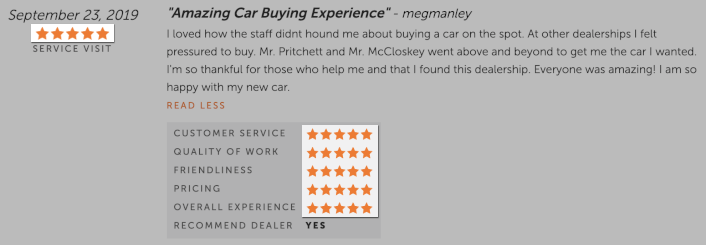

# Dealer Scraping Robot  [](http://travis-ci.org/rzcastilho/dealer_scraping_robot) [](https://coveralls.io/github/rzcastilho/dealer_scraping_robot?branch=master)

Gets the overly positive reviews of the informed dealer and by default returns the first three results from the five first review pages.

The criterias are the reviews with max ratings in all items...



...and body reviews with more occurrences of the ***"overly positive words"*** below.

```elixir
@overly_positive_words [
    "awesome",
    "best",
    "friendly",
    "amazing",
    "excellent",
    "better",
    "wonderful",
    "dream",
    "excellence",
    "highest",
    "knowledgeable",
    "fan",
    "great"
]
```

## Running

Before run install and start PhantomJs.

```bash
$ npm install -f phantomjs
$ phantomjs --wd
```

Build escript.

```bash
$ mix deps.get
$ mix escript.build
```

Run passing the dealer name.

```bash
$ ./dealer_scraping_robot -d "McKaig Chevrolet Buick"
```

Output sample.

```json
[
  {
    "analysis": {
      "overly_positive_words_count": {
        "excellent": 1,
        "friendly": 1,
        "knowledgeable": 1
      }
    },
    "body": "Sales were excellent at Mckaig! Everything was handled professionally and the whole process went very easy and quick. Sales staff was very friendly and knowledgeable about the truck I purchased.",
    "date": "2019-09-20T00:00:00",
    "dealership_rating": 50,
    "ratings": {
      "customer_service": 50,
      "experience": 50,
      "friendliness": 50,
      "pricing": 50,
      "quality_of_work": 50
    },
    "reason_for_visit": "SALES VISIT - NEW",
    "title": "2019 Silverado custom",
    "user": "RJS1234"
  },
  {
    "analysis": {
      "overly_positive_words_count": {
        "awesome": 2,
        "knowledgeable": 1
      }
    },
    "body": "We have really been needing a second vehicle and I had heard several of the McKaig advertisements on the radio but we hadn't really started looking yet. Then, our cousin had some car trouble and while we were at her house, she said she was going to get another car because of all the problems. I mentioned the dealership to her and she googled them reading the reviews. The next week, she bought a car from McKaig and she explained her awesome experience so I talked to my husband and we decided to go look on Saturday. We live in Hallsville and drove to Gladwater to look at vehicles. Tim Pritchett was the first person to greet us after we looked at the vehicles. He was very helpful, he listened, and proceeded to work with us to find a vehicle we liked and could afford. It was very refreshing that no one tried to pressure you and be pushy. Tim worked diligently with Jeriamy Schumacher to ensure we would get approved even though it was close to closing time. We appreciated that it didn't matter that it was after closing and they were still helping us without rushing us. We left Saturday night with a 2018 Doge Ram 1500. On Monday, we came back to finalize the deal. We worked with Freddie Tomlinson to sign all the paperwork. Freddie was very knowledgeable and explained everything so that we could understand and make the appropriate decisions. This has quite simply been the vehicle buying experience either of us has had and it is also the newest vehicle we have owned. We will definitely be buying from McKaig again in the future. I even passed along Tim's business card to a co-worker and told her about our awesome experience since she is now actively looking.",
    "date": "2019-09-21T00:00:00",
    "dealership_rating": 50,
    "ratings": {
      "customer_service": 50,
      "experience": 50,
      "friendliness": 50,
      "pricing": 50,
      "quality_of_work": 50
    },
    "reason_for_visit": "SALES VISIT - USED",
    "title": "Thank you for the awesome experience",
    "user": "hobbrand"
  },
  {
    "analysis": {
      "overly_positive_words_count": {
        "amazing": 1,
        "friendly": 1
      }
    },
    "body": "Kalimba helped us find the car of our dreams that fit us and our 5 kids. Great service, amazing experience, and very friendly employees made it a very easy process.",
    "date": "2019-08-01T00:00:00",
    "dealership_rating": 50,
    "ratings": {
      "customer_service": 50,
      "experience": 50,
      "friendliness": 50,
      "pricing": 50,
      "quality_of_work": 50
    },
    "reason_for_visit": "SALES VISIT - USED",
    "title": "Wonderful Experience!",
    "user": "Zona Edwards"
  }
]
```

To get more options, run with `--help` or `-h` flag.

```bash
$ ./dealer_scraping_robot --help
```

## Links

  * [Repository - github.com](https://github.com/rzcastilho/dealer_scraping_robot)
  * [Code Coverage - coveralls.io](https://coveralls.io/github/rzcastilho/dealer_scraping_robot)
  * [CI - travis-ci.org](https://travis-ci.org/rzcastilho/dealer_scraping_robot)

